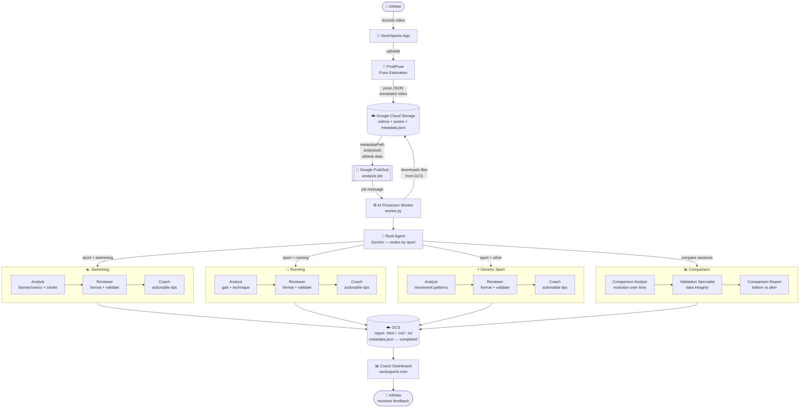

```mermaid
flowchart TD
    ATHLETE(["👤 Athlete"])
    APP["📱 VectoSports App"]
    PROBPOSE["🦴 ProbPose\nPose Estimation"]
    GCS_IN[("☁️ Google Cloud Storage\nvideos + poses + metadata.json")]
    PUBSUB[["📨 Google Pub/Sub\nanalysis job"]]
    WORKER["⚙️ AI Processor Worker\nworker.py"]

    ROOT["🧠 Root Agent\nGemini — routes by sport"]

    subgraph SWIM ["🏊 Swimming"]
        S1["Analyst\nbiomechanics + stroke"]
        S2["Reviewer\nformat + validate"]
        S3["Coach\nactionable tips"]
        S1 --> S2 --> S3
    end

    subgraph RUN ["🏃 Running"]
        R1["Analyst\ngait + technique"]
        R2["Reviewer\nformat + validate"]
        R3["Coach\nactionable tips"]
        R1 --> R2 --> R3
    end

    subgraph GEN ["⚡ Generic Sport"]
        G1["Analyst\nmovement patterns"]
        G2["Reviewer\nformat + validate"]
        G3["Coach\nactionable tips"]
        G1 --> G2 --> G3
    end

    subgraph COMP ["📊 Comparison"]
        C1["Comparison Analyst\nevolution over time"]
        C2["Validation Specialist\ndata integrity"]
        C3["Comparison Report\nbefore vs after"]
        C1 --> C2 --> C3
    end

    GCS_OUT[("☁️ GCS\nreport .html / .md / .txt\nmetadata.json → completed")]
    DASHBOARD["📊 Coach Dashboard\nvectosports.com"]
    ATHLETE2(["👤 Athlete\nreceives feedback"])

    ATHLETE -->|"records video"| APP
    APP -->|"uploads"| PROBPOSE
    PROBPOSE -->|"pose JSON\nannotated video"| GCS_IN
    GCS_IN -->|"metadataPath\nanalysisId\nathlete data"| PUBSUB
    PUBSUB -->|"job message"| WORKER
    WORKER -->|"downloads files\nfrom GCS"| GCS_IN
    WORKER --> ROOT

    ROOT -->|"sport = swimming"| SWIM
    ROOT -->|"sport = running"| RUN
    ROOT -->|"sport = other"| GEN
    ROOT -->|"compare sessions"| COMP

    SWIM --> GCS_OUT
    RUN --> GCS_OUT
    GEN --> GCS_OUT
    COMP --> GCS_OUT

    GCS_OUT --> DASHBOARD
    DASHBOARD --> ATHLETE2
```
